---
## Front matter
title: "Лабораторная работа №6"
subtitle: "Решение моделей в непрерывном и дискретном времени"
author: "Лебедева Ольга Андреевна"

## Generic otions
lang: ru-RU
toc-title: "Содержание"

## Bibliography
bibliography: bib/cite.bib
csl: pandoc/csl/gost-r-7-0-5-2008-numeric.csl

## Pdf output format
toc: true # Table of contents
toc-depth: 2
lof: true # List of figures
#lot: true # List of tables
fontsize: 12pt
linestretch: 1.5
papersize: a4
documentclass: scrreprt
## I18n polyglossia
polyglossia-lang:
  name: russian
  options:
    - spelling=modern
    - babelshorthands=true
polyglossia-otherlangs:
  name: english
## I18n babel
babel-lang: russian
babel-otherlangs: english
## Fonts
mainfont: PT Serif
romanfont: PT Serif
sansfont: PT Sans
monofont: PT Mono
mainfontoptions: Ligatures=TeX
romanfontoptions: Ligatures=TeX
sansfontoptions: Ligatures=TeX,Scale=MatchLowercase
monofontoptions: Scale=MatchLowercase,Scale=0.9
## Biblatex
biblatex: true
biblio-style: "gost-numeric"
biblatexoptions:
  - parentracker=true
  - backend=biber
  - hyperref=auto
  - language=auto
  - autolang=other*
  - citestyle=gost-numeric
## Pandoc-crossref LaTeX customization
figureTitle: "Рис."
tableTitle: "Таблица"
listingTitle: "Листинг"
lofTitle: "Список иллюстраций"
lotTitle: "Список таблиц"
lolTitle: "Листинги"
## Misc options
indent: true
header-includes:
  - \usepackage{indentfirst}
  - \usepackage{float} # keep figures where there are in the text
  - \floatplacement{figure}{H} # keep figures where there are in the text
---

# Цель работы

Основной целью работы является освоение специализированных пакетов для решения
задач в непрерывном и дискретном времени.

# Задачи

- Ознакомиться с основными принципами работы пакета DifferentialEquations.jl для решения задач математического моделирования.
- Изучить методы описания и решения дифференциальных уравнений первого и второго порядка.
- Реализовать модели, описывающие динамику взаимодействия систем, таких как:
    1. Модель Лотки-Вольтерры (жертва-хищник).
    2. Гармонический осциллятор и его вариации.
    3. Конкурентные взаимодействия.
- Построить временные ряды и фазовые портреты для заданных моделей.
- Сравнить аналитические и численные решения для одной из задач.
- Создать анимацию для визуализации динамики фазовых портретов.

# Объект и предмет исследования

Объект исследования: Динамические системы в непрерывном и дискретном времени.

Предмет исследования: Численное поведение решений дифференциальных уравнений, моделирующих различные природные и физические явления.

# Условные обозначения и термины

y', y'' - первая и вторая производные координаты по времени (скорость и ускорение).

a,b,c,d — параметры взаимодействия в модели Лотки-Вольтерры.

"Фазовый портрет" — графическое представление динамики системы в пространстве фазовых переменных

# Техническое оснащение и выбранные методы проведения работы

Программное обеспечение:

Язык программирования Julia.
Библиотеки:
1. DifferentialEquations.jl для численного решения задач.
2. Plots.jl для визуализации графиков и построения фазовых портретов.
3. NLsolve.jl для аналитического нахождения точек равновесия.

Методы:

- Численное интегрирование дифференциальных уравнений методом Рунге-Кутты.
- Построение временных рядов и фазовых портретов.
- Создание анимации для наглядной визуализации динамических систем.

# Теоретическое введение

Julia — высокоуровневый свободный язык программирования с динамической типизацией, созданный для математических вычислений. Эффективен также и для написания программ общего назначения[1].

# Задание

1. Используя Jupyter Lab, повторите примеры из раздела 6.2.
2. Выполните задания для самостоятельной работы (раздел 6.4).

# Задание для самостоятельного выполнения.

Задание Cм. [рис. 1](#fig:001), Cм. [рис. 2](#fig:002)

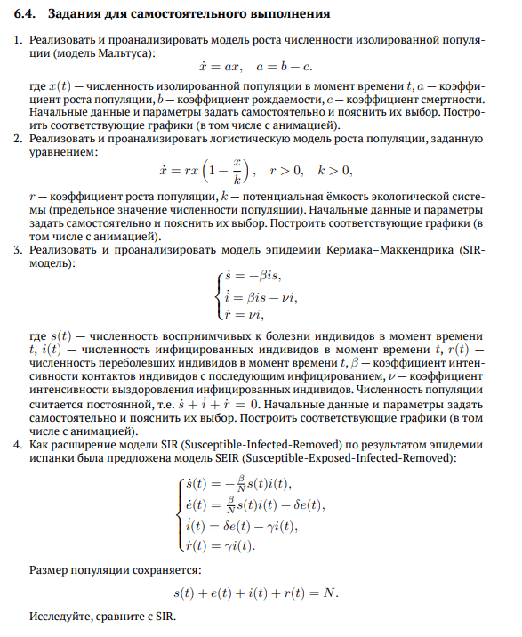{ #fig:001 width=70% }

{ #fig:002 width=70% }

# Повтор примеров

Cм. [рис. 3](#fig:003), Cм. [рис. 4](#fig:004), Cм. [рис. 5](#fig:005), Cм. [рис. 6](#fig:006), Cм. [рис. 7](#fig:007), Cм. [рис. 8](#fig:008)

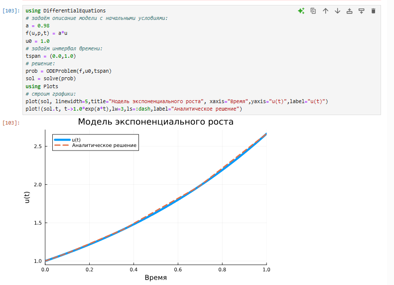{ #fig:003 width=70% }

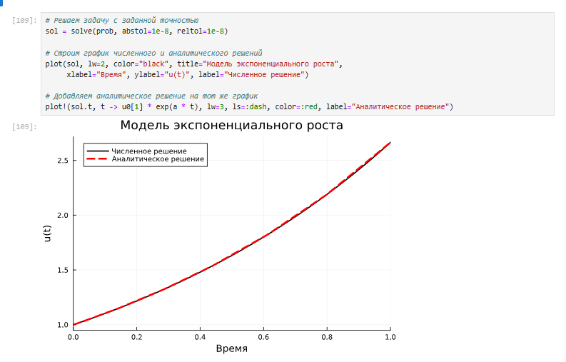{ #fig:004 width=70% }

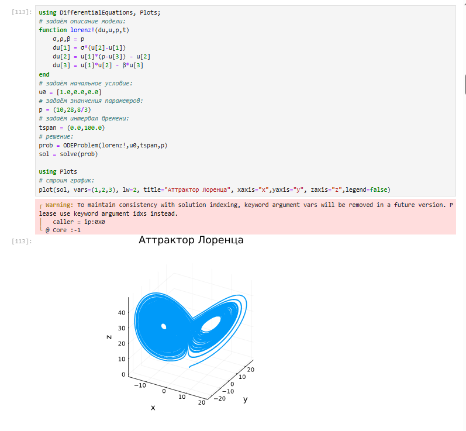{ #fig:005 width=70% }

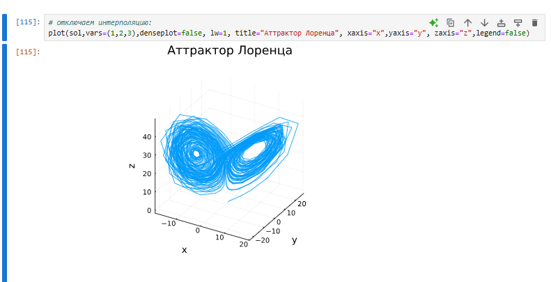{ #fig:006 width=70% }

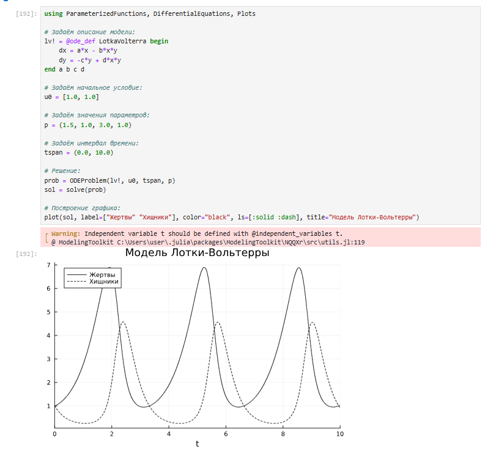{ #fig:007 width=70% }

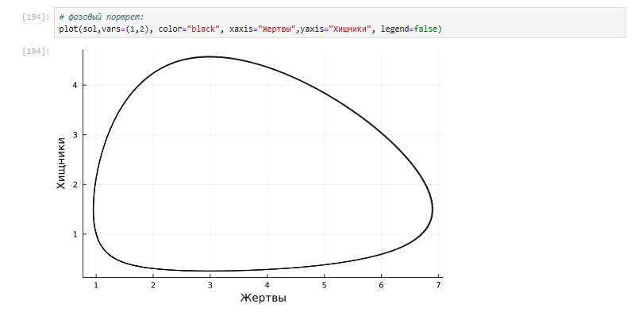{ #fig:008 width=70% }

# Задание для самостоятельного выполнения

Выполним задание 1: См. [рис. 9](#fig:009)

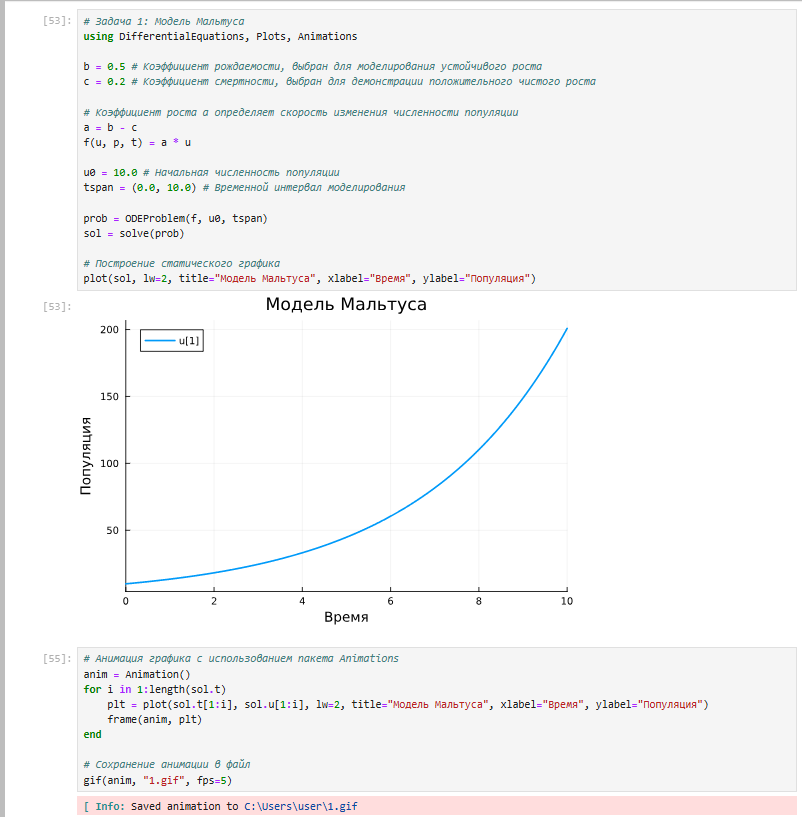{ #fig:009 width=70% }

Параметры модели:

- b=0.5: выбрано для моделирования умеренного роста численности.
- c=0.2: демонстрирует положительный чистый рост (a=b−c=0.3).

Использован пакет DifferentialEquations.jl для численного решения задачи.

Построен график, показывающий экспоненциальный рост численности популяции со временем.

Популяция растёт экспоненциально, что соответствует модели Мальтуса.

Выполним задание 2: Cм. [рис. 10](#fig:010)

{ #fig:010 width=70% }

Выбор коэффициентов:

- r=1.0: выбран для умеренного роста популяции.
- k=50.0: предельная ёмкость среды, задаёт устойчивую численность.
- x(0)=5.0: начальная численность выбрана малой для наглядной демонстрации роста.

Популяция растёт сначала экспоненциально, но затем замедляется и стабилизируется на уровне ёмкости среды k.

Выполним задание 3: Cм. [рис. 11](#fig:011), Cм. [рис. 12](#fig:012)

{ #fig:011 width=70% }

{ #fig:012 width=70% }

Коэффициенты:

- β=0.3: коэффициент интенсивности контактов, показывает вероятность передачи инфекции при контакте между восприимчивыми и инфицированными. Выбран так, чтобы инфекция распространялась умеренно быстро.
- ν=0.1: коэффициент выздоровления, отражает скорость выздоровления инфицированных. 
- Выбран для моделирования продолжительности болезни около 10 дней.

1. Восприимчивые s(t): их доля постепенно уменьшается, поскольку все больше людей заражаются.
2. Инфицированные i(t): вначале их доля растёт, достигая пика, а затем снижается из-за выздоровления и уменьшения количества восприимчивых.
3. Выздоровевшие r(t): их доля монотонно увеличивается, показывая, что всё больше людей выздоравливают и приобретают иммунитет.

График демонстрирует типичное течение эпидемии: начальное быстрое распространение, пик числа инфицированных и постепенное затухание, когда большая часть популяции выздоравливает.

Выполним задание 4: Cм. [рис. 13](#fig:013)

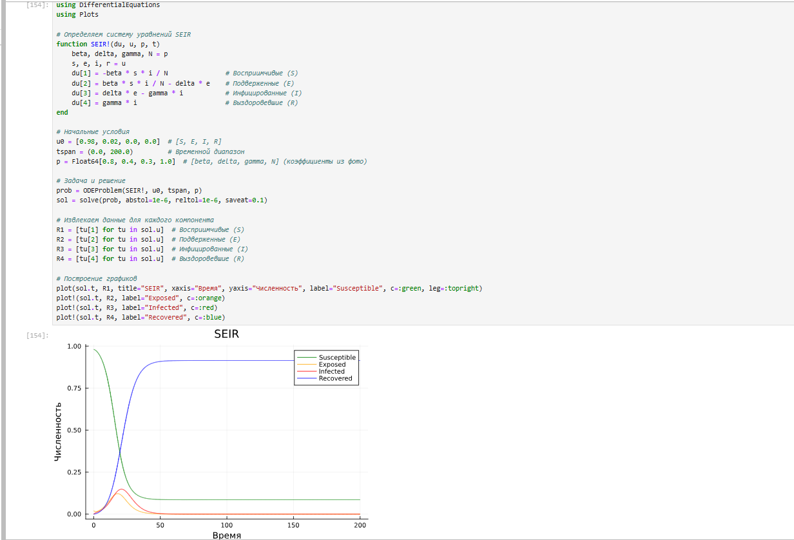{ #fig:013 width=70% }

Коэффициенты:

- β=0.8: коэффициент интенсивности контактов, определяет вероятность передачи инфекции при взаимодействии восприимчивых и инфицированных.
- δ=0.4: коэффициент перехода из латентного состояния (подверженные становятся инфицированными), выбран для моделирования средней инкубации инфекции.
- y=0.1: коэффициент выздоровления, характеризует длительность болезни.
- N=1.0: нормализованная численность популяции, что упрощает расчёты.

1. Восприимчивые s(t): их доля постепенно уменьшается, как и в SIR-модели, поскольку больше людей заражается.
2. Подверженные e(t): новая группа, которая характеризует латентный период. Вначале растёт, затем снижается по мере перехода в группу инфицированных.
3. Инфицированные i(t): динамика схожа с SIR-моделью — рост до пика, затем спад за счёт выздоровления.
4. Выздоровевшие r(t): их доля монотонно увеличивается, показывая постепенное завершение эпидемии.

Сравнение с SIR-моделью:

- Новое поведение: наличие группы подверженных 
e(t) замедляет рост инфицированных 
i(t) по сравнению с SIR, так как инфекция требует времени для инкубации.
- Пик инфицированных: в SEIR он наступает позже, так как часть населения сначала переходит в подверженные 
e(t).
- Точность модели: SEIR более реалистично моделирует заболевания с инкубационным периодом, тогда как SIR подходит для инфекций без латентного периода.

Выполним задание 5: Cм. [рис. 14](#fig:014), Cм. [рис. 15](#fig:015) 

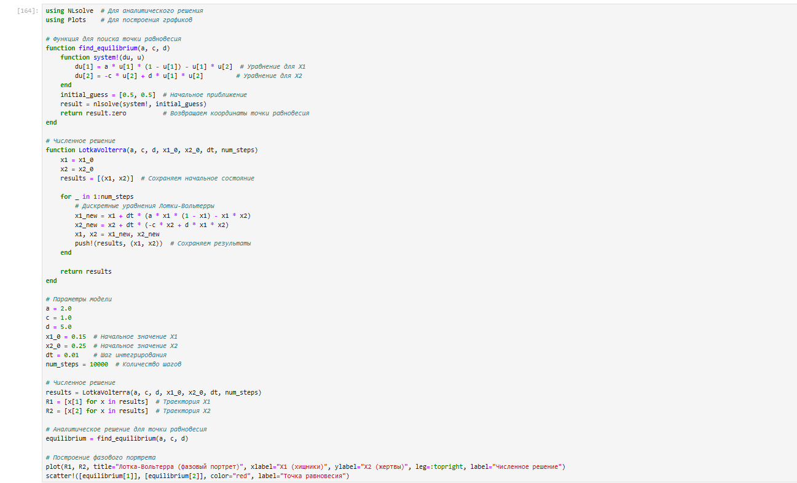{ #fig:014 width=70% }

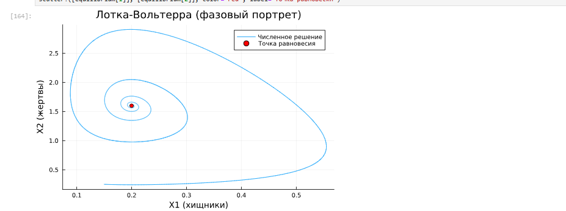{ #fig:015 width=70% }

- a=2: коэффициент роста популяции "жертв".
- c=1: коэффициент убыли популяции "хищников".
- d=5: коэффициент увеличения "хищников" за счёт потребления "жертв".

Аналитическое решение: Для нахождения точки равновесия системы (x1*,x2*) использован метод численного решения с использованием пакета NLsolve. Аналитически вычислена точка: (0.2,0.25)

Фазовый портрет: Построен график, демонстрирующий циклическое поведение системы с постепенным затуханием к точке равновесия.

Сравнение решений:
- Из аналитического и численного решения совпадают, что подтверждает корректность вычислений.
- Фазовый портрет показывает устойчивость системы, поскольку траектории стремятся к точке равновесия.

Модель демонстрирует циклический характер взаимодействия популяций "жертв" и "хищников" с постепенным переходом к равновесию. Численное и аналитическое решения согласуются.

Выполним задание 6: Cм. [рис. 16](#fig:016), Cм. [рис. 17](#fig:017)

{ #fig:016 width=70% }

{ #fig:017 width=70% }

Параметры модели:

- a=0.02: коэффициент роста популяции x, выбран для моделирования медленного увеличения численности.
- b=0.04: коэффициент влияния взаимодействия между х и y, демонстрирующий сильное конкурентное давление.
- х0=16.0: начальная численность первой популяции, предположительно более доминирующей.
- у0=7.0: начальная численность второй популяции, менее конкурентоспособной.
- tspan=(0.0,100.0): временной интервал, чтобы наблюдать долгосрочные изменения.

Популяция x демонстрирует экспоненциальный рост, постепенно вытесняя популяцию y.
Популяция y снижается из-за сильного конкурентного давления от x.

На фазовом портрете видно, как популяция y быстро уменьшается по мере роста популяции x, стремясь к состоянию, где y≈0.

Модель демонстрирует классическое поведение конкурентных отношений, где одна популяция постепенно доминирует, подавляя другую.

Выполним задание 7: См. [рис. 18](#fig:018), См. [рис. 19](#fig:019)

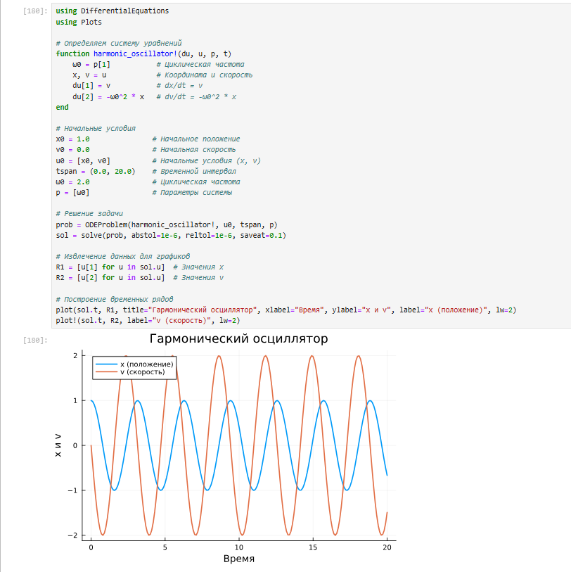{ #fig:018 width=70% }

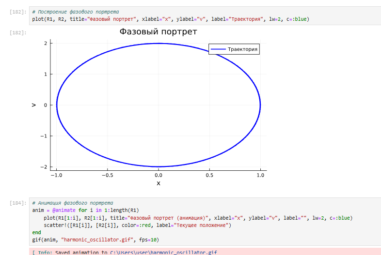{ #fig:019 width=70% }

- х0=1.0: начальное положение объекта. Выбрано для демонстрации максимальной амплитуды колебаний.
- v0=0.0: начальная скорость объекта. Объект стартует из состояния покоя.
- w^2_0=1.0: циклическая частота, которая определяет период колебаний системы.

График показывает, как положение  x и скорость 
v объекта изменяются во времени.
Положение x изменяется по синусоидальному закону, а скорость v сдвинута по фазе на 
π/2 относительно положения.
Колебания являются гармоническими и не затухающими, что соответствует идеальному осциллятору.

Фазовый портрет - траектория на фазовом портрете представляет собой замкнутую эллиптическую орбиту.
Эллипс указывает на сохранение энергии в системе (потенциальная энергия переходит в кинетическую и обратно).-

Выполним задание 8: См. [рис. 20](#fig:020), См. [рис. 21](#fig:021)

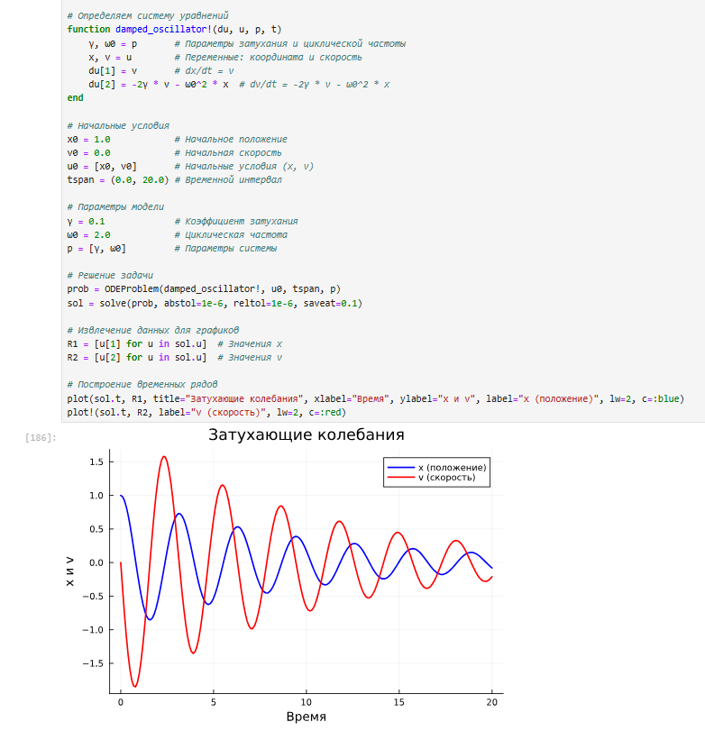{ #fig:020 width=70% }

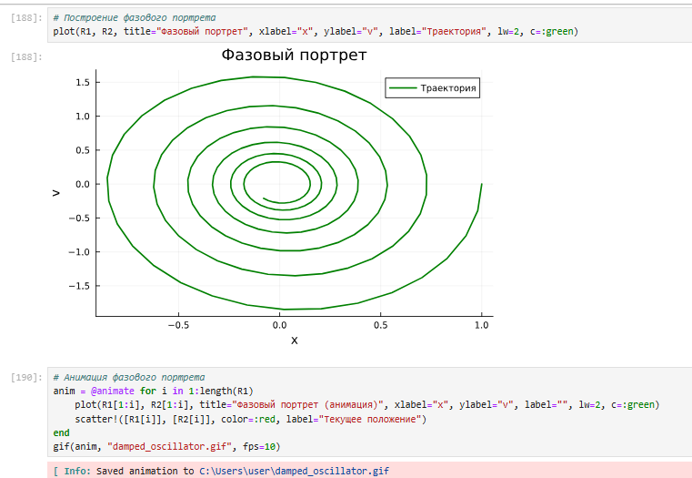{ #fig:021 width=70% }

Параметры модели:

- x0=1.0: начальное положение объекта, максимальное смещение из равновесия.
- v0=0.0: начальная скорость объекта, стартует из состояния покоя.
- w0=1.0: циклическая частота, задаёт период колебаний.
- γ=0.1: коэффициент затухания, отвечает за потерю энергии в системе.
- tspan=(0.0,20.0): временной интервал наблюдения, включает несколько затухающих циклов.

Анализ графиков

1. Положение x и скорость v показывают затухающие колебания.
2. Амплитуда колебаний уменьшается со временем из-за энергии, теряемой системой.
3. Спиралевидная траектория отражает затухание системы, которое стремится к точке равновесия.

# Полученные результаты

Реализованы модели:

1. Лотки-Вольтерры (жертва-хищник): построены временные ряды и фазовый портрет, показавшие периодические колебания популяций.
2. Гармонический осциллятор: в консервативном случае фазовый портрет — эллипс; с затуханием — траектория стремится к точке равновесия.
3. Конкурентные взаимодействия: численности стабилизируются.
4. И др. модели (в том числе, Модель Мальтуса, логистическая модель)

Созданы анимации фазовых портретов для каждой модели, визуализирующие их динамику.

# Заключение

Освоили специализированные пакеты для решения
задач в непрерывном и дискретном времени.

# Библиографическая справка 

[1] Julia: https://ru.wikipedia.org/wiki/Julia

